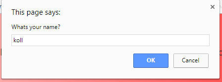
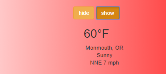
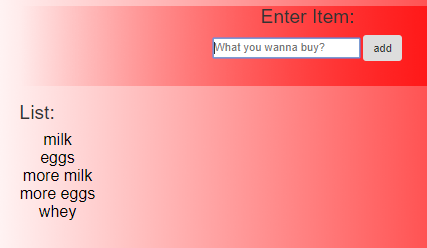
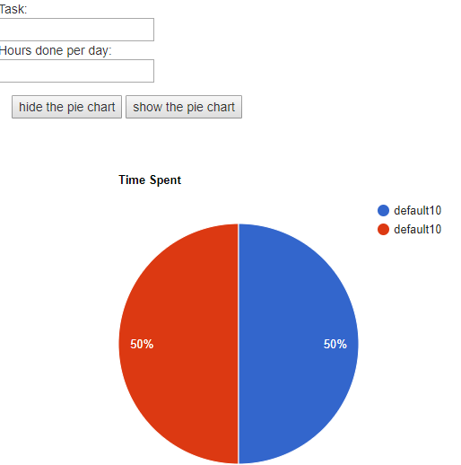

# Overview
After the end of this second week I feel much more confident with a variety of languages. I learned and gained a much better understanding of jQuery, JavaScript, Using Api's to get data to a webpage, and a large amount of different common problems that I will probably run into again in the future. 


## The assignment
The assignment for this week can be found [here](http://www.wou.edu/~morses/classes/cs46x/assignments/HW2.html) and what it was asking for was essentially to use jQuery and Javascript on a webpage and make it do something of value. Coming up with something to make that I was able to follow through with ended up being my biggest challenge for this week and in the end, I was not able to get my first idea to work out. I initially was strying to work with an API from Google that supplied a pie chart and the user was supposed to be able to input data into the pie chart and have the information change. However this didn't work out for a variety of issues that I ran into. I did still learn a large amount from it. I ended up changing ideas to a more simple shopping list. I also added in the weather for monmouth because I felt that adding it in would be something to add a bit more to the page. 


## Steps I took and some code samples
After I decided on switching over to a more simple shopping list and weather info I started by reading into jQuery and Javascript. I used W3 schools as a primary reasource and started off by trying to add a form text box form element that asked for the users name and then used JavaScript to output a brief message with the persons name to the screen. The code and an example image for this is below. 

  

    <script>
    //this is the initial asks for name thing
    function askName(){
        var name = prompt("Whats your name?");
        var message = "Hello " + name + ", if you would like to view the weather click show!"
        document.getElementById('output').innerHTML = message;
    };
    
    </script>



After I get the user input then I threw it into a simple div element on the page to show to the user.

'''
<h3 class = "container-fluid" id="output"></h3>

'''

Continuing on with the site, the next thing I wanted to do was play with some sort of API to make it a bit more interesting of a page. I also wanted something very simple because I didn't have much experience with API's at all. I found a weather api that uses Yahoo weather and put the code in like below into a script element

```  //this is for showing the weather and should be used when the no button is clicked.
reallySimpleWeather.weather({
  wunderkey: '', // leave blank for Yahoo API
    location: 'Monmouth, OR', //your location here, also works in lat/lon
    woeid: '', // "Where on Earth ID" optional alternative to location
    unit: 'f', // 'c' also works
    success: function(weather) {
      html = '<h2>'+weather.temp+'°'+weather.units.temp+'</h2>';
      html += '<ul class = "myList"><li>'+weather.city+', '+weather.region+'</li>';
      html += '<li>'+weather.currently+'</li>';
      html += '<li>'+weather.wind.direction+' '+weather.wind.speed+' '+weather.units.speed+'</li></ul>';
    document.getElementById('weather').innerHTML = html;
    },
    error: function(error) {
    document.getElementById('weather').innerHTML = '<p>'+error+'</p>';
    }
});</script>

```



the script creates a list with some data about the location that can be changed and in addition I added in jQuery to hide and show the calendar depending on if the user clicks the hide or show button. The jQuery ended up looking like the below.

```<script>
$(document).ready(function(){
    $("#hide").click(function(){
        $("#weather").hide(1000);
    });
});
$(document).ready(function(){
    $("#show").click(function(){
        $("#weather").show(500);
    });
});
</script>
```


The next thing that I wanted to do was use jQuery to add new and user dependend elements to the page. So I looked around online a bit for some tutorials on how to make jQuery add items and was able to eventually alter some code to make my list creator work.
sdfasdf





##css

The styling for my site came mostly from test.css and I had a few elements styled inline in my main page. I also found an interesting way to style things using gradients as shown,

 


## Mockup

for the mock up of the site, i ended up going a much different route then originally thought. The inital mock up for the site looked like the below, 





As you can see it is much different then the initial site being that the layout has changed in addition to the overall project itself. The wireframe for the current version ended up looking like,


