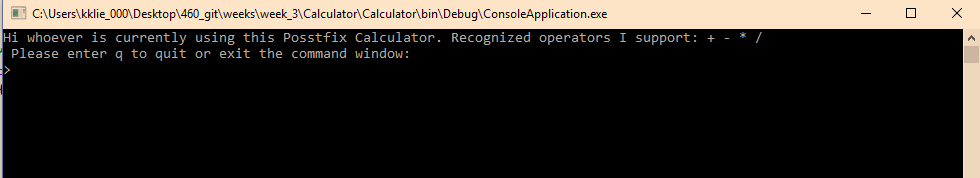
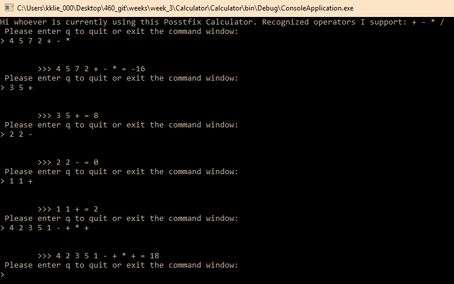
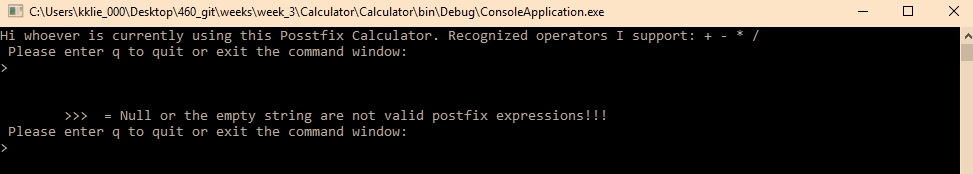
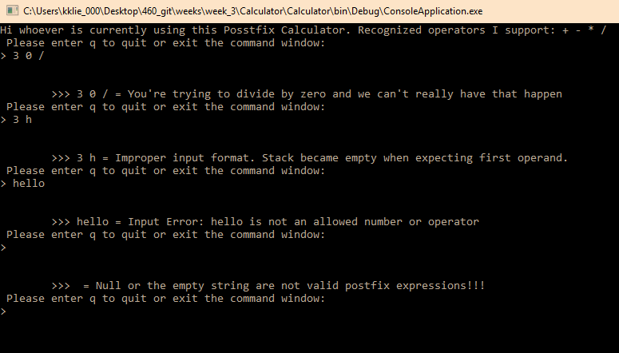
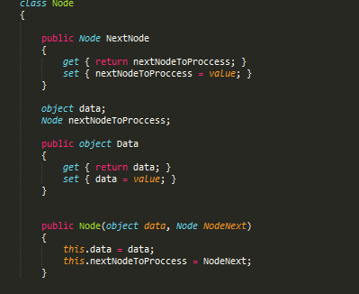
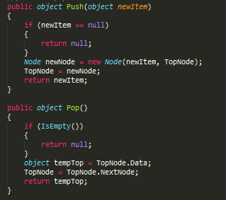
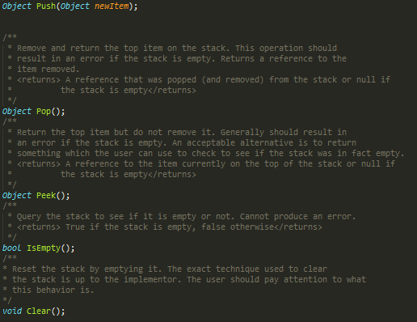
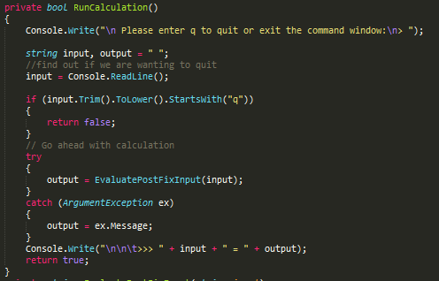
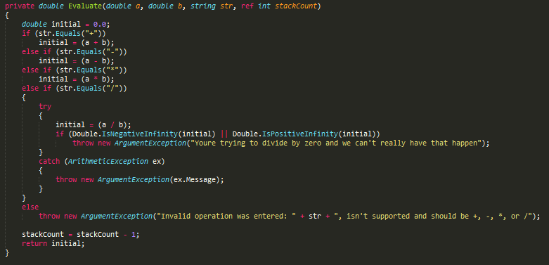

<a href="../../index.html" class="btn btn-primary btl-md" role="button">Back Home </a>

# Overview of week three

## The assignment
The assignment for this week can be found [here](http://www.wou.edu/~morses/classes/cs46x/assignments/HW3.html). The assignment for this week has me starting to learn c# and to translate a java postfix caluclator to C# which is something I did not have any previous experience with. In addition my background comes mostly from Chemeketa which uses C++ and my Java is decent but I'm less confident with it then many other Western CS students might be. Because of this I spent a bit of time quickly brushing up again with Java. 

## Link to code on Github
The code for this assignment can be found [here](https://github.com/kollklienstuber/460/tree/master/weeks/week_3) 

## Steps I took and some code samples
To start learning I began by getting an overview of the language and watching [this youtube video](https://www.youtube.com/watch?v=lisiwUZJXqQ), which I found very useful and helped to give a good overview of the language. After I decided to just jump into the code with the goal of getting things up and running. I started by jumping in and writing the c# code to the best of my limited knowledge but had a good amount of luck with finding reasources that translated over really well to help me fix my errors and translate the java code to c# for this assignement. My biggest issue that set me back was something that had a pretty simple fix as well. I for a while got stuck with the error <code> type or namespace name could not be found </code> and was able to fix this when I figured out I had a slew of spelling errors. Eventaully thought the code came together and visual studios cooperated well and got the code to compile and below are some images of the output of when I ran the program. 

## Some pictures of the calculator up and running
On start up of the program this is what we see

We are able to enter in a variety of post fix expressions and get the expected result as well as shown below!

We are also able to get back information if the user enters in data that doesn't make sense for a post fix calculator and in addition errors back out to the console for things like divide by 0 errors.

##Some Code 
Below is some of the code that I used for this assignment. The complete code can again be found [here](https://github.com/kollklienstuber/460/tree/master/weeks/week_3) 

A peice of Node.cs

Push and pull 

Stack

main

