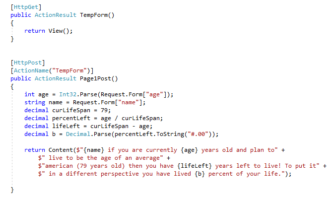

<a href="../../index.html" class="btn btn-primary btl-md" role="button">Back Home </a>

# Overview of week Four

## The assignment
The assignment for this week can be found [here](http://www.wou.edu/~morses/classes/cs46x/assignments/HW4.html). The assignment for this week has me starting to learn ASP.NET MVC 5. I had no experience prior to this week of the subject and I found it confusing at first. However After reading through the pro asp.net book chapters 1 and 2 i began to better grasp how the controller and view work together. The assignment also ended up being called PartyInvites.sln sense I started with the MVC book and that is what they labeled there project.

## Link to code on Github
The code for this assignment can be found [here](https://github.com/kollklienstuber/460/tree/master/weeks/week_4/PartyInvites) 

## Steps I took and some code samples
I started this assignment with a bit of confusion and supplimented this confusion by reading through the asp.net mvc book for this class which did help me get a better idea of using MVC. My biggest issue was confusion not with how the model view and controller relate at a high level, but I had trouble understanding how they were connected at a lower level. However after reading through the book and watching some YouTube videos on the subject I better understood that visual studio did a large amount of the work on the back end like knowing the routing structure of how it looks for files and how it can automatically populate different areas of the code for you. 

##Index page code and visuals.
For my index page and all the others I thought that it would be better for me to not use any sort of layout at all and while I think it helped inititally, it made some of the other pages a bit less visually appealing. The index page is shown below.

##code for index page
for my index page it had a simple HTML layout and 3 HTML action links. The Action links parameters were ("button label", "controllerName","FolderOfController") This was something that confused me at first because I had trouble understanding how the action links and other html helper methods worked and had trouble at times finding relevant information online. Below is some code of my Index page.

## Part one:
For part one I decided to make a simple page that asks for your age and then returns information about the amount of time left you have left to live based on a simple calculation. A visuilization of this is below along with the page that gets returned after the user enters in the input. One thing I could have spent more time on is making the output more visually appealing. 

##code for part one 
Some of the code for part one can be found here. The controller is shown first and then the model. My controller used the data from the form in my view and this was also something I found very useful once I was able to understand what was going on and figure out that visual studio was able to pull the variables from my view while the code was in the controller. 

##code for view of part one
My view for part one was a html body that had a form inside of it.

##part two 
For part two I decided to take in user input that included a users age, weight and gender and returned information about the amount of macronutrients they should be consuming on a daily basis based off of very breif reasearch. 

##part two controller and view

For the view I did the same thing as part one except I used a few different form types. 

##part three

For part three I ended up doing first and last in regards to how I started this assignment. I was unsure exactly how to work with the post and get methods and so went to the book and followed along with the tutorial and it helped a lot to get a better understanding of what I needed to do. I ended up using the RSVP calculator that the book went through but modified it a bit as to make it not a complete copy of the books example. It did also use a model which is something I ended up adding into my HW 4 as to keep the ability to follow along. This RSVP form used model binding and also validation of the input the user sent to the server. 

##part three MVC images. 
For part three the data was stored in a model called guest response that used getters and setters to collect the data. 

The view for part three was also adapted from the books tutorial and used a lot of html helper methods and this was something I found difficult at first because it had me googling a lot to figure out what each different helper method was doing. However it did end up giving me a better idea of the different ways that lambda functions can be envoked and used. 

Overall this assignment at first had me confused about working with MVC but now I feel much more comfertable working with it as well as visual studio. I think that for the next assignment I will spend more time on the asthetics of it. 

