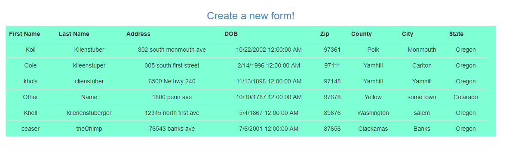

<a href="../../index.html" class="btn btn-primary btl-md" role="button">Back Home </a>

# Overview of week Five

## The assignment
The assignment for this week can be found [here](http://www.wou.edu/~morses/classes/cs46x/assignments/HW5.html). The assignment for this week had me starting to learn the database functionality of ASP.NET MVC 5. I had no experience over this subject prior to this week and I found it confusing at first and some of the biggest issues I had surrounded getting the right settings and my MVC system set up and linked together correctly. In addition I had issues with things that still leave me a bit confused in regards to running my site. Specifically, I ran into problems where I would run my project and would get different errors depending on what page I ran my project from which made little sense and gave me issues in figuring out what was actually wrong. Eventually the site created successfully but I got to completion with some confusion as to why some of the code was actually working. I imagine it probably has a bit to do with the magic of MVC and Visual studios that goes on behind the scenes.

## Link to my code on Github
The full code for this assignment can be found [here](https://github.com/kollklienstuber/460/tree/master/weeks/week_5) and some sample images of the code are also shown below.  

## Some Issues and initial steps
I started this assignment in a way that eventually had me back track and start over multiple times due to having trouble connecting to the database, linking code together and having a not super solid understanding of what I was doing. However I think I eventually got a decent grasp over the end result of the project. For my variables I used the required naming conventions to help with their creations as shown below. I started with my model which looked like, 

## Controllers
I used two controllers, One that was just a plain controller that linked to my index page, 

and another one, "RequestController" that handled serving the content of the create and view pages. a small peice of it is shown below.

## Views of the actual page
Below are some images of the site in action,

For my create form page I used some action links and bootstrap styling to have it turn out looking like the below,

My landing page ended up looking like the below,

My page to show all of the current forms looks like the below before it is populated with my up.sql script,

After my up.sql script is ran it gets populated with some information and in addition if I add in a person manually it displays the following,

## Database Up.sql and Down.sql
For the creation of the local database I used a simple down.sql that just simply dropped the table, and for the up.sql I followed the bitbucket class code examples but added in my own vairables rather then the "user" variables found on that page as shown below. When I wasn't getting errors the table was able to successfully build after I had put in the proper connectiong string to my web.config file

 <add name="FormContext" connectionString="Data Source=(LocalDB)\MSSQLLocalDB;AttachDbFilename=C:\Users\kklie_000\Desktop\460_git\weeks\week_5\week5b\week5b\App_Data\Database1.mdf;Integrated Security=True" providerName="System.Data.SqlClient"/>

I also had to make sure that my connection to the database wasn't set to master which was something that slowed me down as well but I was able to fix by changing it to my local file systems routing to the proper database. 

up.sql

down.sql

## Views 
My landing page view from my default controller was just a simple html action link to the create and view database results page as show below, 

For the views that handled showing and updating the database they used multiple html action links and model binding so I was able to access the model with ease. Some code samples of these are shown below,

My DAL file was also added in early on and it seemed to be one of the parts that connected semi smoothly and looked like the below.

Overall this assignment at first had me confused about working with Databases because of all the small parts of it and all the interconnectivity. I ran into a large amount of issues that were solved by usually finding a single line of code or adding in a library. I do feel more comfortable but I know I need to go back and make sure I have a bit more confidence with working with a database with MVC before moving on. 

