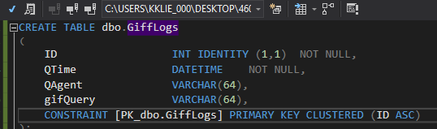
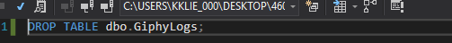

<a href="../../index.html" class="btn btn-primary btl-md" role="button">Back Home </a>

# Overview of week seven


Not finished, have ran into multiple problems but wanted to focus on weeks eight and nine due to them alligning with the final


## Link to my code on Github
The full code for this assignment can be found [here](https://github.com/kollklienstuber/460/tree/master/weeks/week_7) and some sample images of the code are also shown below.  


## Starting with hiding the api key
I went and made an account of giphy in order to get an api Key to use to access there data and gifs. One I registered and recieved my key the next step was to hide the key so that It couldnt be found by others to use.

To do this i needed to place the path to my key that is saved locally on my machine into my appsettings element of my config file.
 ```cs <appSettings file="C:\Users\kklie_000\Desktop\460Misc\apiKey.config"> ```


My next step was to create my main view and the only view that will be displayed for this assignment being that the Ajax will limit the need to refresh or need additional views.


## controllers

My controllers for this assignment consisted of two different controllers. 
My home controller returned the view to index via an actionmethod.

My second controller was the controller that handled most of the functionality and ajax but this was something I had many versions of due to trying to fix errors but haven't gotten a succesful link yet.


## database 

I decided to at least create the foundation of my database but have not yet gotten it working with the log data that will be put into the database. My up.sql and down sql view as follows,





