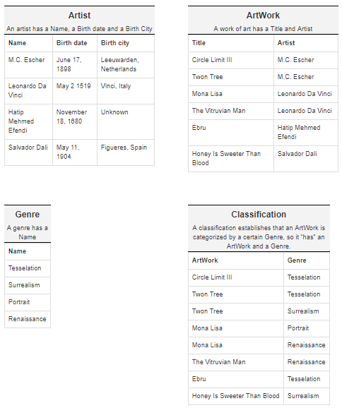
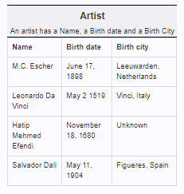

<a href="../../index.html" class="btn btn-primary btl-md" role="button">Back Home </a>

# Overview of week eight


## Link to my code on Github
The full code for this assignment can be found [here](https://github.com/kollklienstuber/460/tree/master/weeks/week_5) 

## Link to project hosted on Azure
The project can be found [here](azurelink.com) 


##Steps 

First off I created a new project in visusal studio 

file -> new project -> asp.net web application and named it HW8.

I created it by having the MVC icon highlighted in order to have a few automattically created pages.

Once My project was created I went in and right clicked my app data folder and added a new sql server database called artWork. This created artWork.mdf and artWork_log.ldf in my app_data folder and gave me an initial database to work with.

I then want to go in and double click my artWork.mdf file to open up the server explorer where I can then right click on my database "artWork" and select new query. This opens up a new tab named SQLQuery1.sql which i will eventually save and rename to be my up and down.sql. 

I am wanting to first create the up and down .sql in order to initiate the types of data that will be in the database. 

TO do this In the query that comes up when I double click my database and then select new query on it, i want to save the query as up.sql but I want to save it into my same folder that my project "hw8"'s database "artWork" is saved into. which is the appdata file and more specifically, this folder, "C:\Users\kklie_000\Desktop\460_git\weeks\week_8\hw8\hw8\App_Data"

However once I add the file it will not show up and isn't added to my solution explorer until I right click my app data folder and add new item and then go and double click my up.sql file in my appData folder that I had recently created.

For the first step we are instructed to, 
"Begin with the domain model. There are four entities: Artist, ArtWork, Genre and Classification. This page explains the relations between entities and provides seed data. All relations must be present as named constraints in your database schema. Draw or generate an E-R diagram of your database schema."

How I went about this was after understanding that we have the following data that we are wanting to add into the database, 




I used that information to construct in my up.sql the way the data will be held in the database.

There are four different entities that will become a table, I started with Artist. For my artists table in particular and the three other tables I worked with the following information like the following but with whatever table I was currently on,  

This information tells me that I will want to have as my data in the table, a primary key as a way to identify a single artist, a name for the artist, and the birthplace of an artist. The following tables ended up looking like, 

```sql
-- Users table
CREATE TABLE dbo.Artists
(	
	--artist PK as ID
	ArtistID	INT IDENTITY (1,1) NOT NULL,
	--Artist name, city as 128 length char
	ArtistName	NVARCHAR(128) NOT NULL,
	ArtistCity NVARCHAR(128) NOT NULL,
	--Artist Date of birth as Date object
	ArtistDOB	Date NOT NULL,
	-- constraints for a PK
	CONSTRAINT [PK_dbo.Artists] PRIMARY KEY CLUSTERED (ArtistID ASC)
);

CREATE TABLE dbo.ArtWorks
(
	ArtWorkID	INT IDENTITY (1,1) NOT NULL,
	ArtistID INT,
	ArtistName	NVARCHAR(128) NOT NULL,
	Title	NVARCHAR(64) NOT NULL,
	CONSTRAINT [PK_dbo.ArtWorks] PRIMARY KEY CLUSTERED (ArtWorkID ASC),
	CONSTRAINT FK_ArtistID FOREIGN KEY (ArtistID)
	REFERENCES Artists(ArtistID)
);

CREATE TABLE dbo.Genres
(
	--sense Genres is a single column table we dont need to link it to anything VIA a FK 
	--Genre is linked to others because others (classifications) needs to know about it, 
	--but it doesnt need to know about anyone else
	GenreID			INT IDENTITY (1,1) NOT NULL,
	GenreName	NVARCHAR(64) NOT NULL,
	CONSTRAINT [PK_dbo.Genres] PRIMARY KEY CLUSTERED (GenreID ASC)
);


CREATE TABLE dbo.Classifications
(
	--classifications doesnt have much data (only two columns) but all the data it does have is 
	--a FK of other tables so we must reference and add them.
	ClassificationID		INT IDENTITY (1,1) NOT NULL,
	ArtWork		NVARCHAR(64) NOT NULL,
	Genre		NVARCHAR(64) NOT NULL,
	GenreID INT,
	ArtWorkID INT,
	CONSTRAINT [PK_dbo.Classifications] PRIMARY KEY CLUSTERED (ClassificationID ASC),
	--We will add in Genre sense it is used in classifications table so we must have some reference to it
	CONSTRAINT FK_GenreID FOREIGN KEY (GenreID)
	REFERENCES Genres(GenreID),
	--Same as above but with Artwork Table
	CONSTRAINT FK_ArtWorkID FOREIGN KEY (ArtWorkID)
	REFERENCES ArtWorks(ArtWorkID)
);


--Once tables are created insert into them the appropriate data

--Insert into artists table
INSERT INTO dbo.Artists (ArtistName,ArtistCity,ArtistDOB) VALUES 
	('M.C. Escher','Leeuwarden, Netherlands','1898-06-17 00:00:00'),
	('Leonardo Da Vinci','Vinci, Italy','1519-04-02 00:00:00'),
	('HAtip Mehmed Efendi','Unknown','1680-10-18 00:00:00'),
	('Salvador Dali','Leeuwarden, Figueres, Spain','1904-05-11 00:00:00')
GO

--Insert into ArtWorks table
INSERT INTO dbo.ArtWorks (ArtistName,Title) VALUES 
	('M.C. Escher','Circle Limit III'),
	('M.C. Escher','Twon Tree'),
	('Leonardo Da Vinci','Mona Lisa'),
	('Hatip Mehmed Efendi','Ebru'),
	('Salvador Dali','Honey Is Sweeter Than Blood')
GO

--Insert into Classifications table
INSERT INTO dbo.Classifications(Artwork, Genre) VALUES 
	('Circle Limit III','Tesselation'),
    ('Twon Tree','Tesselation'),
	('Twon Tree','Surrealism'),
	('Mona Lisa','Portrait'),
	('Mona Lisa','Renaissance'),
	('The Vitruvian Man','Renaissance'),
	('Ebru','Tesselation'),
	('Honey Is Sweeter Than Blood','Surrealism');
GO

--Insert into Classifications table
INSERT INTO dbo.Genres(GenreName) VALUES 
	('Tesselation'),
    ('Surrealism'),
	('Portrait'),
	('Renaissance');
GO


```


For my Genre Table and Artist table I did not need to reference any Forien Keys (FK) because the data it had was not data that relied on any other tables. Unlike the Classifications or the Artwork table, which did need FK's. For example the Classifications table needed 2 FK's. One from Genre and one from Artworks. The classifications table essentially didn't have any unique data. Unlike the Artwork table which had a combination of Unique and non unique (Artist) data.

Once I had my tables created Then I want to go ahead and connect to my data base and then insert the data into it. To do this i had to,
1: click the connect button next to the empty (white) text box
2: click local ->mssqllocalDB -> connect (like below image)

3: Once its connected then I can click the white empty text box and change it to the path of my database, 

4: it is now connected and so I can, if i want to check it worked, double click my artwork.mdf and view the tables.


Next I want to fill my tables with data, to do this I just highlight the query text and run it again.
To see if this worked and to see if the data is entered I can again double click my database, right click a table, and show table data to see the newly populated information.

##down.sql 

For my down.sql it was the same steps as the above, except with the following code used for the down.sql. 


```sql
DROP TABLE IF EXISTS dbo.Classifications;
DROP TABLE IF EXISTS dbo.ArtWorks;
DROP TABLE IF EXISTS dbo.Genres;
DROP TABLE IF EXISTS dbo.Artists;
```


##creating shared layouts
The next step:
Place a menu item on the shared layout to select one of three views: Artists, ArtWorks and Classifications. Each of these views should show all artists, works of art and classifications, respectively, that are in the database. i.e. they are each a list view. Also add a home page with some form of a welcome.


TO do this I started by creating the home page. The home page was simple in the sense that all i did to it was remove the auto created code and just put in a few sentinces about art.

Next I went and created the links in the shared layout. to do this I just changed the current links to the new links to pages that I created.

```html

            <div class="navbar-collapse collapse">
                <ul class="nav navbar-nav">
                    <li>@Html.ActionLink("Home", "Index", "Home")</li>
                    <li>@Html.ActionLink("About", "About", "Home")</li>
                    <li>@Html.ActionLink("Contact", "Contact", "Home")</li>
                </ul>
            </div>
```

changed to 


```html
      			<ul class="nav navbar-nav">
                    <li>@Html.ActionLink("Home", "Index", "Home")</li>
                    <li>@Html.ActionLink("Artists", "Artists", "Home")</li>
                    <li>@Html.ActionLink("ArtWorks", "ArtWorks", "Home")</li>
                    <li>@Html.ActionLink("Classifications", "Classifications", "Home")</li>
                </ul>
```


Next I created my pages above as views in my home folder so that the links took a user to the correct page.


Next I wanted to auto generate my connect string and my model classes. To do this the steps were,
1:right click models 
2: add new item
3: on the code tab select data and then select ado.net entity data model and give it a name. 
4: select the code first from database option 
5: next it will ask "which data connection should your application use and for this I want to click new connection"
6: in the new window i want to select the data source as a database file and then select the database file name to be my .mdf database I created for the project.
7: use windows authenitfication and test connection and then connect.
8: on the next page I want to save the connection string as what it defaults to. 
9: select all the tables to be generated, plurilize the names for readability sake and click finish


If all goes well then the models are now created automatically in the project. However we still need to add restrictions to certain peices of data like not letting an artists birthday be a date in the future.

## working with models 

The models for this project after being auto generated didnt need a lot of work, the only changes that I made to my models were the following,
1: for my artists I added the following  [Display(Name = "Full Name")] or whatever to each appropriate data type. in addition i added  [Key] above my classification id


```cs

        [Required]
        [StringLength(128)]
        [Display(Name = "Full Name")]
        public string FullName { get; set; }

        [Required]
        [StringLength(128)]
        [Display(Name = "Birth City")]
        public string BirthCity { get; set; }


```


At this point I have my models and database up as well as some initial views, but now after having the backend system created and ready we want to give users the ability to view the data in our database as well as have crud functionality for our artists. in addition I started working with my controller, "homecontroller" to work with the corresponding pages.

In my home controller I added in private dbContext db = new dbContext(); so I am able to use the database like below. 
In addition I added in the includes to my homeController the following, 

using System.Net;
using System.Data.Entity;
using hw8.Models;


```cs

    public class HomeController : Controller
    {

        //remember to include hw8.Models;
        private dbContext db = new dbContext();

        public ActionResult Index()
        {
            return View();
        }

```


The first page I started with was my classifications page. To show the information of my classifications page I modified my controller so that the data is in a new list of string instances which I can use in my view.

```cs
       //returns classifictions 
        public ActionResult Classifications()
        {
            return View(db.Classifications.ToList());
        }

```


```html
@model IEnumerable<hw8.Models.Classification>
@{
    ViewBag.Title = "Classifications";
}
<table class="table">
    <tr>
        <th>
            @Html.DisplayNameFor(model => model.ArtWork)
        </th>
        <th>
            @Html.DisplayNameFor(model => model.Genre)
        </th>
    </tr>
    @foreach (var item in Model)
    {
        <tr>
            <td>
                @Html.DisplayFor(modelItem => item.ArtWork)
            </td>
            <td>
                @Html.DisplayFor(modelItem => item.Genre)
            </td>
        </tr>
    }
</table>

```


I did the same thing for my artworks view except replaced


```html

   <th>
            @Html.DisplayNameFor(model => model.ArtWork)
        </th>
        <th>
            @Html.DisplayNameFor(model => model.Genre)
        </th>

``` 

with

```html

		<th>
            @Html.DisplayNameFor(model => model.Title)
        </th>
        <th>
            @Html.DisplayNameFor(model => model.Artist)
        </th>

``` 

Again i did the same thing for my genre view but with the data being changed to the data in my genre table.

These are things done in previous labs so didn't come with much issue.


## crud for artists as well as artists view
Here are the 5 items needed:

1: Artist Index/List page
2: Artist Create page (Create)
3: Artist Details page (Read)
4: Artist Edit page (Update)
5: Artist Delete page (Delete)

To do this I started with making my main artists page with just displays data from the artists table similar to the above views. This took care of the following step number 1

For step 2, create I started by making my create actionresult in my controller and my page to create. The action result for my create get was looked like this,

```cs
     public ActionResult CreateArtist()
        {
            return View();
        }

```

and my post for the created looked as follows,


```cs
             //post artist
        [HttpPost]
        [ValidateAntiForgeryToken]
        public ActionResult CreateArtist([Bind(Include = "ArtistID, ArtistName, ArtistDOB, ArtistCity")] Artist artist)
        {
            if (ModelState.IsValid)
            {
                db.Artists.Add(artist);
                db.SaveChanges();
                return RedirectToAction("Artists");
            }

            return View(artist);
        }

```

I then went and added in the create view.


For our details page The view consited of displayed the data that is searched for in the database using     
```cs Artist artist = db.ArtWork.Find(id); ```

and if the artist exists then we store the information for the artists in our post controller using viewbags that we will return to the view.


