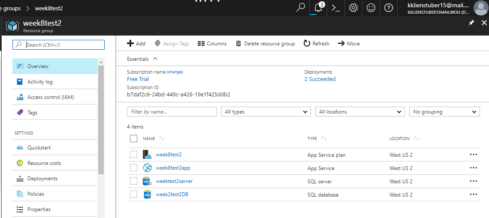
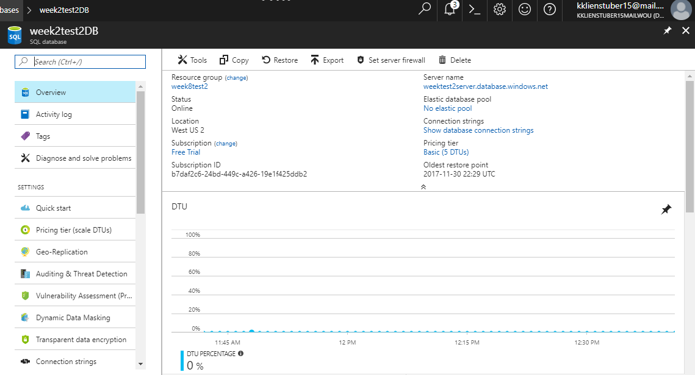
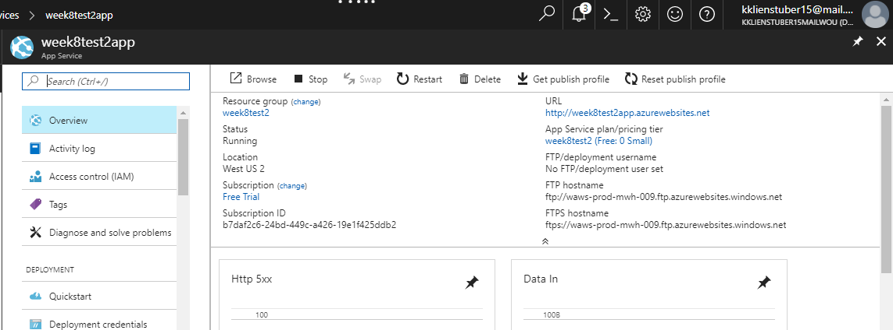
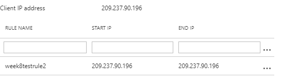
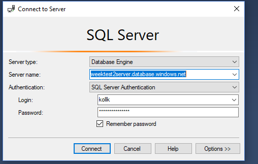
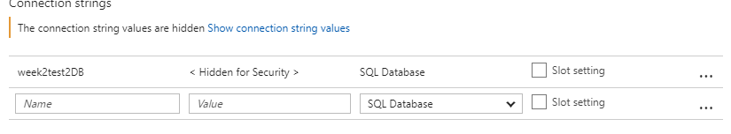
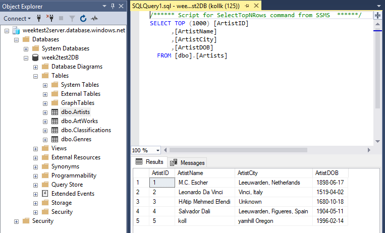

<a href="../../index.html" class="btn btn-primary btl-md" role="button">Back Home </a>

## Overview of week nine


## Link to project hosted on Azure
The project can be found [here](http://week8test2app.azurewebsites.net/) 

s

## Cloud Connection 
The steps I took to connect 

1: log into azure and go to resource groups -> add 

2: name it whatever and then save the location as us west 2 but make note so you can also be sure to make everything else saved in that same location. click create.




3: go to sql databases and click add 

4: enter a name and use existing resource group (the one you just created) 
5: blank database, not now to elastic pool, and then click the server to open up a new window
6:in the server window name it, make a username and password to remember and do the same location and click select. also keep the alow azure services checkbox checked  Then we go back to the database page.


7: change the pricing plan to basic and apply

8: leave collation default -> click create





9: next we want to create the web app. Go to app services -> add -> web app (not the one with sql) and on the next page click create at the bottom

10: name it and give it the same resource group as the one you created.

11: create new app service plan, name it, give it same location as the other, and for pricing go to the very bottom and click free, then create it. 





12: next we want to set firewall for database so got to sql database -> the database your using -> set server firewall -> name the rule name whatever -> copy the client ip and paste it in the start and end spots and click save.





13: now we want to go to Sql server management studio and log into our database. to do this we on the opening dialog of SSMS have the server type of database engine, and for the server name we have to go to Azure, and go to sql databases -> find our database -> and then copy the servername and then paste it into the server name box. next for authentificaition select SQL server Authentication and log in with the credentials used when you created recently the cloud database and reasources.

14: click connect and then in object explorer i should be able to see my database, right click it -> select new query -> and run my up.sql script in that query. This will populate the tables. 





Next I want to make my connection string in my local project to do this,
1: go to sql server databases and then click my database
2: copy my connection string replacing the my name and my password leaving the brackets. 
3: i then take that string and copy it over into my web config into my connecting string variable like so,
```config
 <connectionStrings>
  <add name="dbContext" connectionString="Server=tcp:weektest2server.database.windows.net,1433;Initial Catalog=week2test2DB;Persist Security Info=False;User ID={kollk};Password={Password};MultipleActiveResultSets=False;Encrypt=True;TrustServerCertificate=False;Connection Timeout=30;" providerName="System.Data.SqlClient" />
</connectionStrings>
```







4: then I want to go into Azure again and go to, app services -> the app i created -> application settings  and add my connection string. The name is the name of my add above, so "dbContext" and the value is the same connection string as the above.


## publishing 

to publish the app i want to go to build -> publish 
1: microsoft azure app service
2: select existing radio button -> publish
3: select my account and my subscription and reasource group and then in the bigger text box click on my project and click ok.

It will run and eventually pop open my app.


## git to not forget

(on branch development)$ git merge master
(resolve any merge conflicts if there are any)
git checkout master
git merge development (there won't be any conflicts now)